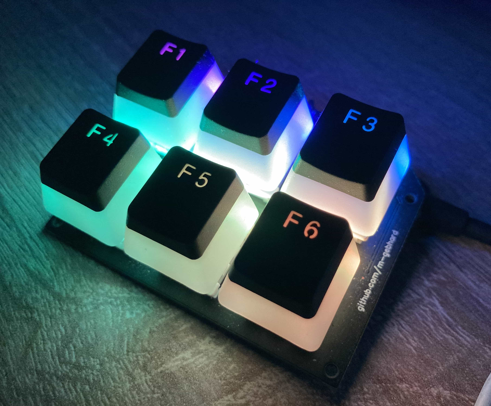
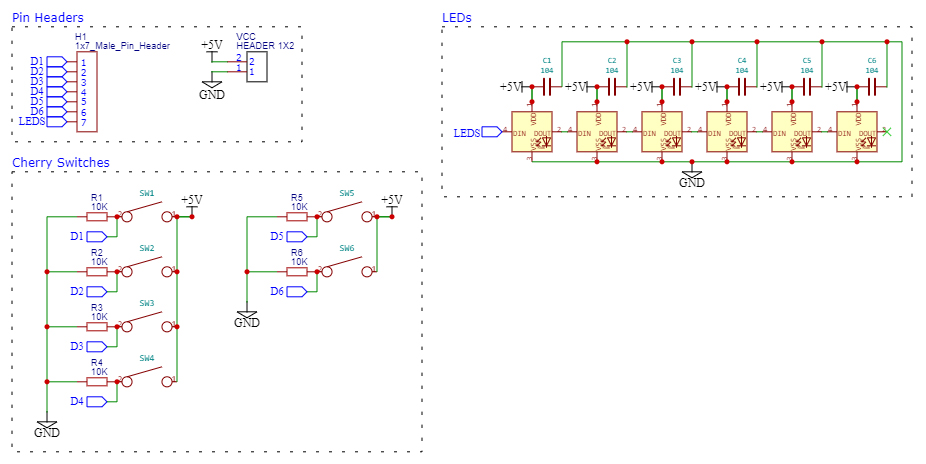

# Cherry MX illuminated Keypad

## Description
Uses 6 cherry mx switches to send media commands.
Each switch has an led, all of them can be controlled separately.
3 LED modes are available: Static color, gradient and move animation.
The selected mode is saved in EEPROM.

Key bindings can be customized, see:
https://github.com/NicoHood/HID/wiki/Consumer-API

## Arduino Dependencies

`FastLED ^3.3.2`

`HID-Project ^2.7.0`

## Preview

## Standalone schematic (WIP)
